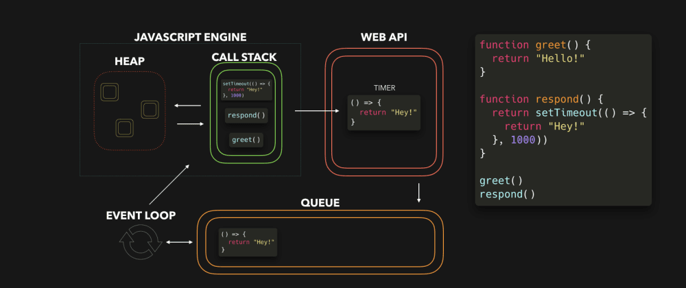
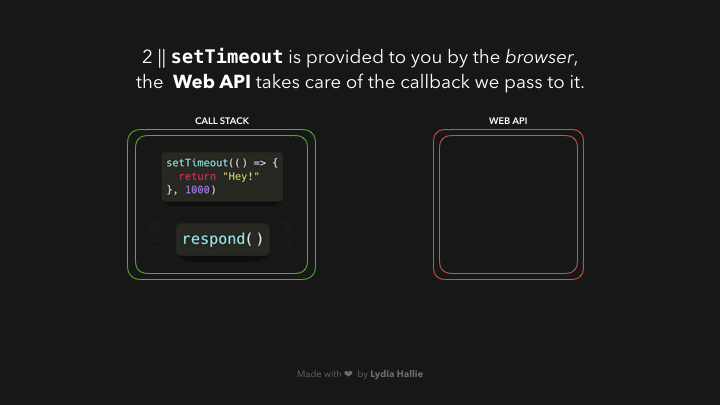

### 可视化之事件循环
转载自[JavaScript Visualized: Event Loop](https://dev.to/lydiahallie/javascript-visualized-event-loop-3dif)



JavaScript 事件循环，是每个JS开发者必须掌握的。但是对于刚接触这一概念的人可能会对此有些困惑。我是一名视觉型学习者，我想利用gif动态图来帮助你从视觉方面理解事件循环的概念，尽管这些gif图分辨率较低并有些模糊。

首先，事件循环到底是什么又为何需要你关注呢？

JavaScript 是单线程运行：同时只能运行一个任务。一般情况下，这并不是大问题。但是想象一下，如果你运行一个耗时30秒的任务...在此期间，我们除了等待30秒之外无事可做。（因为js默认运行在浏览器主线程，所以整个UI渲染都被阻塞而卡住了）。拜托，都2019年了，我们可不想要个卡顿的浏览器。

幸运的是，浏览器给了我们JS一些没有的特性：Web API。包括 DOM API，settimeout，HTTP 请求等。这能让我们执行一些异步，非阻塞的行为。

当我们调用函数时，此函数被加入到调用栈中。调用栈是JS引擎所有的而非浏览器实现。这是一个栈，意味着先进后出。当函数执行完毕后从栈中弹出。


函数 response 返回 setTimeout 函数。setTimeout 由Web API 提供，可以延迟执行任务且不会阻塞主线程。传入 setTimeout 的回调箭头函数 ()=>{return "Hey!"} 被加入到Web API。此时，setTimtout 与 response 函数先后被弹出调用栈，他们都返回了自己的返回值。


在 Web API 中，只要时间到达我们传入的第二个时间参数(即1000ms)之后，定时器就会执行。但是回调函数并不会立即加入到调用栈中，而是被加入到执行队列中。


这里有些令人迷惑的地方：在1000ms之后，此回调函数并没有加入到调用栈中（并返回数据），而仅仅是被加入到执行队列中。这个一个队列，此回调函数需要按顺序等待。

接下来是我们一直期待的部分，事件循环出场去做它唯一需要做的事情：关联执行队列和调用栈。当调用栈清空，即所有被调用的函数执行完毕并弹栈之后，执行队列的第一项就会被加入到调用栈中。这种情况下，没有其他函数被调用，意味着滴调用栈是空的，此回调函数是执行队列中的第一项。


此回调函数被加入到调用栈，执行后返回，然后被弹出栈。


纸上得来终觉浅，觉知此事要躬行。请指出下方代码的执行结果。
```
const foo = () => console.log("First");
const bar = () => setTimeout(() => console.log("Second"), 500);
const baz = () => console.log("Third");

bar();
foo();
baz();

```

做对了吗？我们来快速看下上面这些代码在浏览器中的执行过程吧。

1. 调用 bar，返回 setTimeout 函数
2. setTimeout 的回调函数被加入到 Web API 中，setTimeout 和 bar 函数被依次弹栈
3. 计时器开始执行，与此同时 foo 函数被调用，加入调用栈，打印 First ，返回 undefined ，被弹出调用栈
4. baz 函数被调用，加入调用栈，打印 Third ，返回 undefined ，被弹出调用栈。此时调用栈清空。
5. 500ms后 setTimeout 的回调函数被加入到执行队列，事件循环检测到调用栈为空后将回调函数加入到调用栈中。回调函数被执行，打印 Second 返回 undefined 被弹栈。

（思考：当执行队列中存在待执行函数时，事件循环怎么确定主线程没有函数将会入栈而）
思考：
1. 执行队列有待执行函数
2. 主线程中有数个待执行函数，他们一次加入调用栈
3. 每执行完一个函数弹栈后，调用栈都是空的，
4. 事件循环需要知道，此时虽然调用栈是空的，但是主线程仍有待执行任务，而不能加入事件队列中的函数入栈
5. 问题：在这个过程，事件循环如何得知主线程还有待执行任务的呢？

希望能帮助你更好的理解事件循环。不要害怕问题，最重要的事情是找到困难的原因并通过 google 或者 stackoverflow 去解决问题。如果有任何疑问轻联系我。

