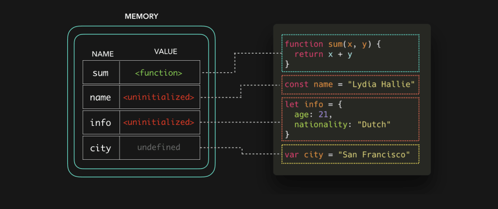

### 可视化之变量提升

转载自[JavaScript Visualized: Hoisting @Lydia Hallie](https://dev.to/lydiahallie/javascript-visualized-hoisting-478h)

「变量提升」是每个JS开发者都听过的概念之一，因为你在google搜索JS的报错并在 StackOverflow 中找到答案：此错误是由变量提升引起的。那么何为变量提升呢。（注：为保持文章的精简专注，作用域将会在接下来的文章中解释）

如果你刚接触JS，那么你可能遇到过 undefined ，ReferenceError 等报错。人们经常会把变量提升解释为变量和函数被提升到文件的最顶部，虽然变量提升的行为看起来确是这样，但实际并非如此。

当JS引擎解析代码时，它首先会将代码中的数据设置到内存中。此时并不会执行代码，仅是为执行代码做准备。函数声明和变量保存的方式是不同的。函数名仅保存了函数实体的引用。

但是变量保存却很不一样。ES6引入两个新关键字定义变量：let 和 const。let 和 const 声明的变量保存时并未初始化。

使用 var 声明的变量在保存时会以 undefined 进行初始化。

创建阶段完成之后就可以执行代码。让我们看看在文件顶部、定义变量和函数之前调用3个 console.log 的输出结果。

既然函数名保存着函数实体的引用，我们甚至可以在定义函数之前调用函数。

在一个使用 var 关键字声明的变量定义之前引用此变量时，我们只会得到此变量保存的默认值：undefined。然而这有时会引起一些意想不到的结果。这意味着大多数时候你只是无意中引用此变量的（你应该并不想获得 undefined 值）

为了防止意外引用一个值为 undefined 的变量，就像使用 var 关键字声明变量那样，在我们想要访问未初始化的变量时，将会抛出 ReferenceError 错误。在变量实际声明之前的区域，被称为「暂时性死区」：你不能在变量初始化之前引用他们（也包括ES6的 class）

当JS引擎解析到变量实际声明之处时，内存中的变量值将会被我们实际赋予的值所覆盖。

总结：
1. 函数和变量在代码执行前被保存在内存中以便执行上下文使用。被称为变量提升。
2. 函数名保存着函数实体的引用，以var关键字声明的变量保存时以 undefined 值进行初始化，以 let/const 关键字声明的变量保存时不会进行初始化。

希望我们在"看到"执行代码的过程之后，会更加明了变量提升的概念。当然，即使还没完全了解这种概念也不要担心。你用的越多，就越会得心应手。有任何疑问，请随时联系我。
