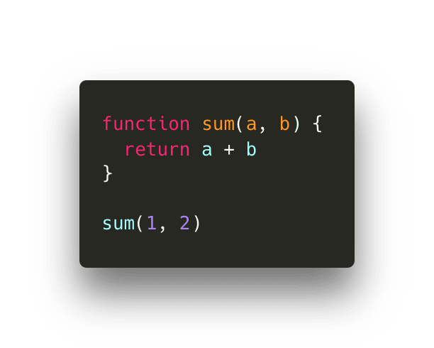

### 可视化之JS引擎

转载自[JavaScript Visualized: the JavaScript Engine  @Lydia Hallie](https://dev.to/lydiahallie/javascript-visualized-the-javascript-engine-4cdf)

javascript 是很酷，但是机器到底是如何理解你所写的代码的呢？作为JS开发者，我们通常并不自己处理编译器。然而，了解些JS引擎基础并明白它如何将对人类友好的JS代码转化为机器能够理解的东西，对我们大有裨益。
注：本文主要基于Node.js和Chromium的V8引擎。

HTML解析器遇到一个带有 src 属性的 script 标签时，会从互联网，缓存，或者已安装的服务器中下载源代码。请求脚本的响应是字节流，字节流解码器将会处理。当下载完成之后，字节流解码器就会解码字节流。

解码器从被编码字节流中创建 token 。例如 0066, 0075, 006e, 0063, 0074, 0069, 006f, 006e 分别被解析为 f u n c t i o n。就像你写了一个 function。这是一个 js 保留字，每一个 token 就会将其传入到解析器中（还有预解析，这个过程我没有用 gif 表达但是随后会说到）。余下的所有字节流都会经过相同的处理。

JS引擎使用两种解析器：预解析器和解析器。为了减少加载网页的时间，JS 引擎会尽量避免解析那些不会立即使用的代码。预解析器处理那些可能稍后会使用的代码，而解析器处理那些立即需要使用的代码。如果一个函数仅在用户点击按钮后调用，那么JS引擎并不会立即编译它，而是先加载网页。如果用户最终点击了按钮需要这段代码，这些代码会被发送到解析器中。

解析器基于从字节流解码器中接收的 token 创建了节点。通过这些节点，创建抽象语法书，即AST。

接下来就是解释器出场了。它遍历AST并基于AST的信息生成字节代码。一旦字节代码生成完毕，AST被删除，并清理内存空间。最终我们就有了机器可以工作的东西。

尽管字节代码运行很快，但是它还能更快。当这些字节代码运行时会生成一些信息。它会检测到一些行为是否会经常用到，可以检测到所使用的数据的类型。如果你经常会调用某个函数，那么是时候优化代码以使其执行速度更快了。

字节代码和生成的类型反馈一起，被发送到优化编译器中。优化编译器通过字节代码和类型反馈生成高度优化的机器代码。

JS是动态类型语言，意味着数据类型将会不断发生变化。对应JS引擎来说，不断检查一个确切数据的数据类型是非常耗时的。

为了减少解释代码的时间，在运行字节码时,经优化过的机器码仅会处理JS引擎之前看到的事件。如果我们不断的调用一段返回相同数据类型的代码，经优化的机器码会被重复使用以优化执行速度。然而，因为JS是动态类型语言，一段代码可能会突然返回一个不同类型的数据。如果这种情况发生，机器码就会"退化"，JS引擎就会转而重新解释已生成的代码。

假设一个函数被调用100次，并总是返回相同的值。那么可以假设第101调用时，它也会返回相同的值。

我们假设有如下函数，每次调用时都会传入数值型参数。

返回3。假如下次我们再次调用时，仍传入两个数值型参数。

如果假设是真的话，动态查询就不需要，JS引擎就可以复用已优化的机器码。如果假设不成立，就会还原为原本字节代码而不是经优化的机器码。

例如，下次我们调用此函数时，传入一个字符串而不是数字参数。以为JS是动态类型，所以我们这么做并没有错。

这意味着数字2被强制转换为字符串，函数将会返回字符串12。JS引擎会退而执行经解释的代码，并更新返回类型。

希望这篇文章能够对你有用。当然还有很多JS引擎的知识点我想要在这篇文章中随后介绍（堆，调用栈等）。如果大家对JS内部原理感兴趣，我真心地希望你们能够开始自己研究。V8引擎是开源的，而且有很多很棒的文档解释了它的运行原理。

[V8文档](https://v8.dev/) || [v8 github](https://github.com/v8/v8) || [Chrome University 2018: Life of a Script](https://www.youtube.com/watch?v=voDhHPNMEzg&t=729s%3Cbr%3E%0A)

