### 可视化之生成器与迭代器

转载自[JavaScript Visualized: Generators and Iterators @Lydia Hallie](https://dev.to/lydiahallie/javascript-visualized-generators-and-iterators-e36)

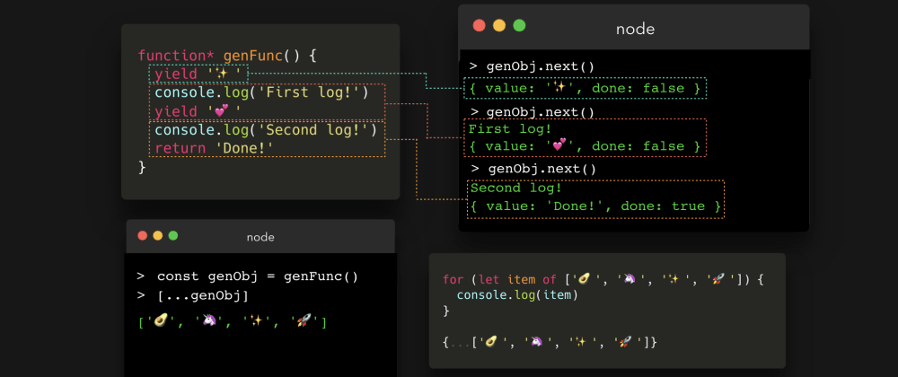

ES6引入一个非常酷的特性：生成器函数。每当我询问别人生成器相关内容时，基本上回答就是诸如："我曾看过一次，但是很困惑，就再也没有看过了"、"哦，天啊。我阅读过很多关于生成器的博客，但是我仍然没有弄懂它"，又或者是"我懂生成器，但是为什么没有人使用它们呢"。这可能也是我多次问自己的问题，因为我之前思考了很久。但是它的确非常酷。

所以，啥是生成器函数呢？让我们先看看常规的函数。
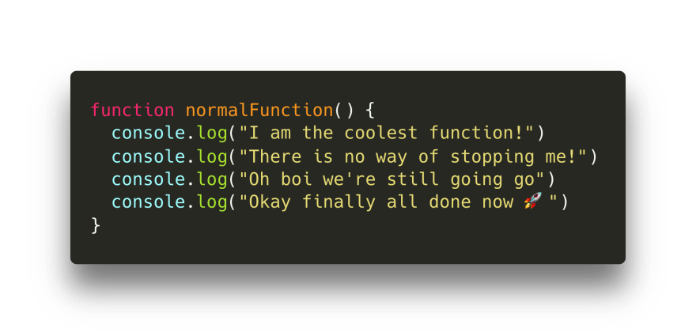

这个函数真没啥特别之处。仅仅是一个普通的打印4次的函数。我们调用一下它。
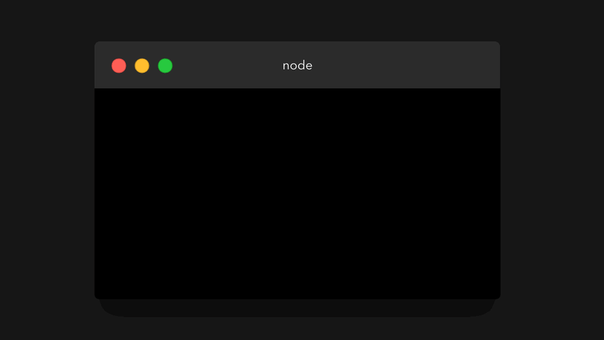

"但Lydia，为啥你浪费我5秒钟的生命让我看着这么无趣的函数呢"。这是一个好问题。普通函数遵循着运行-完成的模式：当我们调用一个函数时，它就会执行直到完成（当然，除非某处报错了）。我们不能随时随意地在函数运行中暂停函数执行。

最酷的地方就在于此，生成器函数并不遵循运行-完成模式。这是否意味着我们能够自由地在函数运行时暂停它呢？好吧，某种程度上来说，是的。让我们看看生成器到底是啥，以及我们可以用它来干啥。

我们在 function 关键字后面写一个星号 * 就可以创建一个生成器函数。
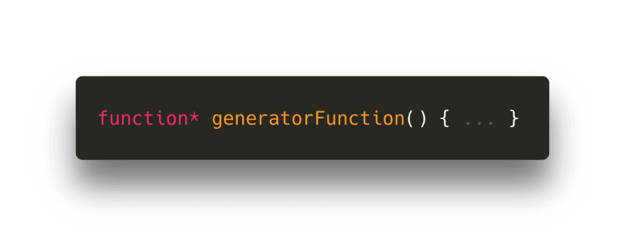

但这并不是使用生成器的全部。生成器函数的工作方式和普通函数的确大相径庭。
- 调用生成器函数会返回一个生成器对象，即迭代器
- 我们可以在生成器内部使用 yield 关键字来暂停函数执行

但这些到底意味着啥呢？

我们来分析第一条：调用生成器函数返回一个生成器对象。当我们调用一个普通函数时，函数体执行，并最终返回一个数值。然而当我们调用一个生成器函数时，会返回一个生成器对象。我们打印返回数据看看它长啥样。

现在我好像能听到你内心的呐喊（也许是真的叫喊），因为这看起来有一些鸭梨山大。但是不要担心，我们并不会用到你看到的这些属性。那么生成器对象到底有啥好呢？

首先我们需要向后一步，回答普通函数和生成器函数的第二个不同之处：我们可以通过 yield 关键字来暂停函数的执行。

我们可以写一个如下的生成器函数：
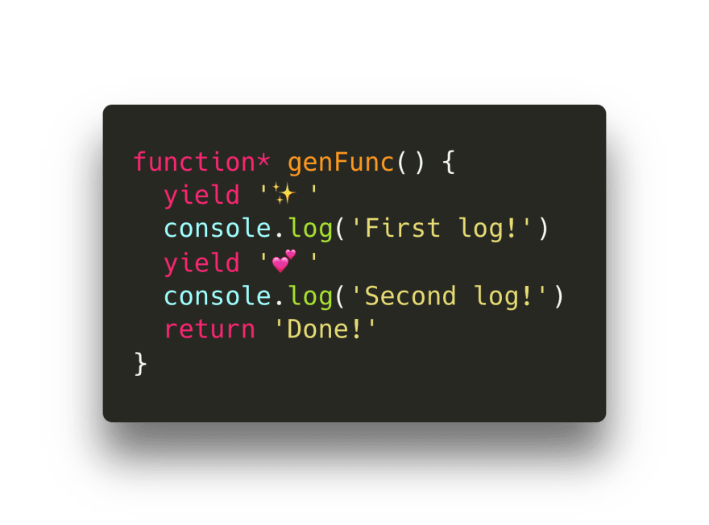

yield 关键字的作用是什么呢？在遇到 yield 关键字时生成器的执行会被暂停。而且非常好的是下次我们继续运行此函数时，它能够记得之前被暂停的地方并且从此处继续执行。以下是基本的执行流程（稍后会有动图展示）：
1. 第一次执行时，函数在第一行暂停并产生一个 ✨
2. 第二次执行时，它从之前的 yield 关键字所在的那行开始执行。它一直向下执行，直到遇到第二个 yield 关键字，产生 💕
3. 函数第三次执行时，仍然从上次 yield 关键字所在的那行开始。它一直向下执行直到遇到 return 关键字，返回 Done。

但是，如果我们之前调用了生成器返回生成器对象，我们该如何调用这个函数呢？这就是生成器发挥作用的地方。

生成器对象包含一个 next 方法（存在于原型链上）。这个方法可以用来迭代生成器对象。但是，为了记住此函数在之前产生一个值之后暂停的状态，我们需要将生成器对象赋值给一个变量。在这里我将之命名为 genObj 。

此对象仍然像我们之前看到的对象那般吓人。让我们看看 genObj 在调用 next 方法之后会发生什么。

此生成器一直运行直到遇到第一个 yield 关键字，就像第一条所说的那样。它产生一个对象包含一个 value 和 done 属性。 { value: ... , done: ... }

value 属性等于我们通过 yield 生成的值；
done 属性是一个布尔值，仅在生成器函数 return 返回值（而不是 yield）时才会置为 true。

我们停止迭代生成器，这个函数看来了就像是暂停了一样。这该多酷啊。让我们再次调用 next 方法。

首先，在控制台打印出了 First log! 这既不是 yield 也不是 return 关键字，所以函数继续运行。然后函数遇到 yield 关键字，产生值 💕。此时会产生一个拥有 value 和 done 属性的对象。value 的值为 💕， done 的值为 false, 因为这个函数还没有执行到 return 关键字返回数据。

马上就要结束了，我们最好执行一次 next 方法。

控制台打印字符串 Second log! 之后执行到 return 关键字返回值 Done。返回一个对象，属性 value: Done。这次函数最终执行完毕，所以属性 done 的值为 true。

属性 done 是非常重要的。我们仅仅只能迭代出一个生成器对象一次。什么？当我们再次调用 next 方法时，发生了什么呢？

最终生成器对象返回 undefined。以防你想再次迭代它，你不得不新创建一个生成器对象。

如我们刚刚所见，生成器函数返回了一个迭代器（生成器对象）。那么，什么是迭代器呢？是否意味着我们可以使用 for...of 循环，而且可以对返回的对象进行展开操作呢？没错！

我们使用 [...] 来展开生成的数据生成数组。

或许使用 for...of 循环?
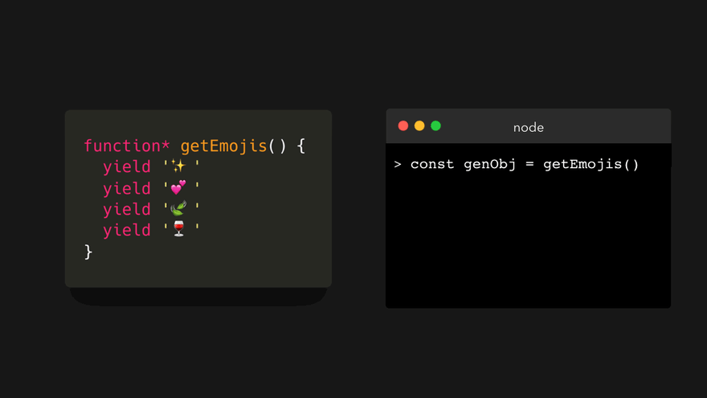

竟然如此多种可能。

但是什么原因使得迭代器可迭代的呢？因为我们可以使用 for-of 循环，并且可以使用展开操作符处理数组，字符串，map,set。那是因为它们实际上实现了迭代器的协议：[Symbol.iterator]。假设我们有如下的值（它们的名字很直观）：

array, string, generatorObject 都是可迭代的。观察下它们的 [Symbol.iterator] 属性：

对应不可迭代的数据，其 [Symbol.iterator] 属性是什么呢？

对，这些数据中没有此属性。所以，我们能手动添加 [Symbol.iterator] 属性，使得不可迭代数据变得可迭代吗？当然可以！

[Symbol.iterator] 将返回一个迭代器，包含 next 方法，此方法返回一个形如 { value: '...', done: false/true } 的对象。

为了简单起见，我们可以将 [Symbol.iterator] 属性值设置为一个生成器函数，因为此函数会默认返回一个迭代器。我们把一个对象变成可迭代，yield 数据为整个对象。
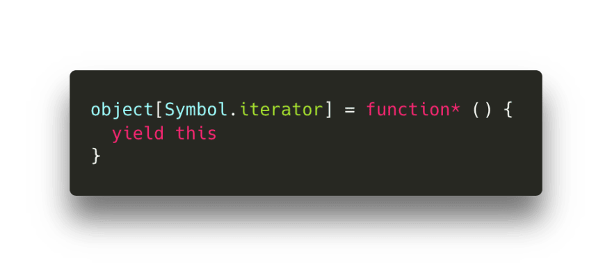

来看看当我们对对象使用打散操作或者 for-of 循环时，会发生什么：

又或者我们想要获取对象的所有属性，这也很简单，我们仅需要 yield Object.keys(this) 就行了。
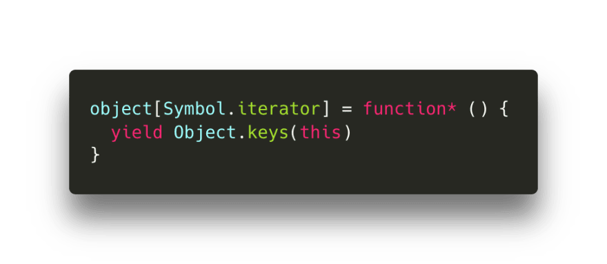

看看运行结果

糟糕，Object.keys 返回的是数组，所有将此值 yield 之后会得到一个数组。我们打散这个 yield 数组组成另一个数组，生成一个嵌套数组。我们并不想要这个，我们仅仅想要 yield 每一个单独的属性。

好消息，在生成器中我们可以使用 yield* 关键字从迭代器中 yield 每个数值。假设我们有一个生成器函数 yield 一个鳄梨，然后我们想 yield 另一个迭代器中的每一个元素。我们可以使用 yield* 关键字做这些。我们新建另一个生成器函数。

采用这种方法我们可以获取一个对象的所有属性。
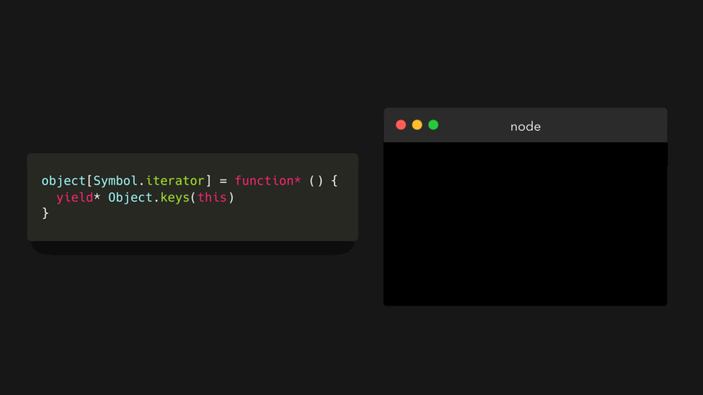

另外一种生成器函数的使用方式，是我们能够在一定程度上使用他们来观察函数。生成器会等待接下来的数据，只有在此数据到达之后，它才会处理。例子如下：
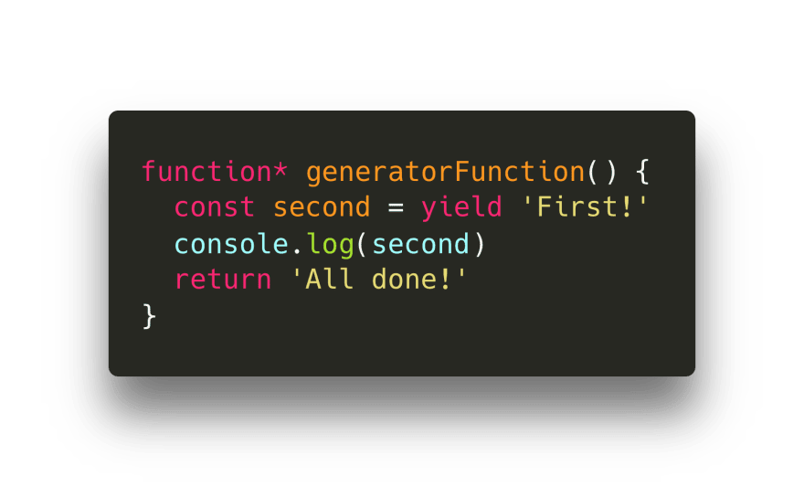

这里一个较大变化是我们并没有像之前的例子那样 yield [value] 。而是把值赋值给 second 变量，并且 yield First。这是我们第一次调用 next 时所会 yield 的数据。

我们看看当我们在此迭代器上第一次调用 next 方法会发生什么。
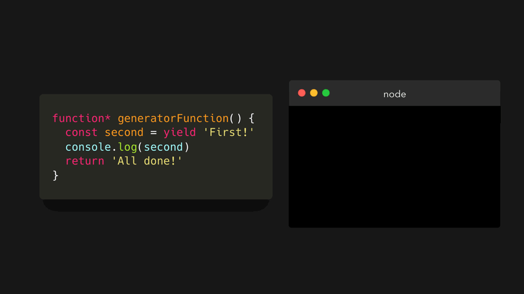

它在第一行遇到 yield 而且生成值 First。那么，变量 second 现在是什么呢？

其实，second 的值是我们再次调用 next 方法时传递的参数。这次，我们传入参数 'I like JavaScript'。
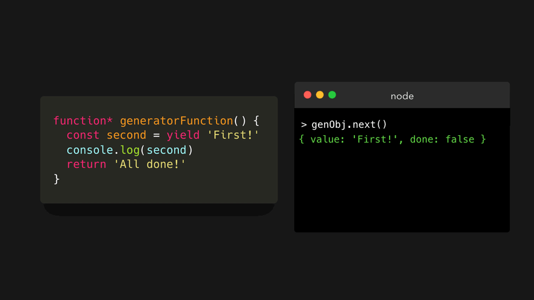

看到这里，我们知道第一次 next 的调用并没有跟踪任何输入，这单很重要。我们第一次仅仅是通过调用来开始观察函数。生成器等待着我们的输入才会继续执行、处理我们传入next的参数。

所以，为什么你曾想要使用生成器呢？
其中生成器能带来的最大的好处是，他们可以进行懒计算。这意味着调用next方法的返回值是我们希望它计算之后得到的。普通函数并没有这种功能：所有的值都给你生成了以免你在未来什么时间会使用到它。

还有另外几种用处，但是我通常喜欢在我迭代大量数据时我能够使用这种更加可控的方式。

想象一下我们有许多读书会。为了使此例子简短些，没有那么多的代码，每个读书会只有一名成员。每个成员正在读几本书，代表着书本集合。
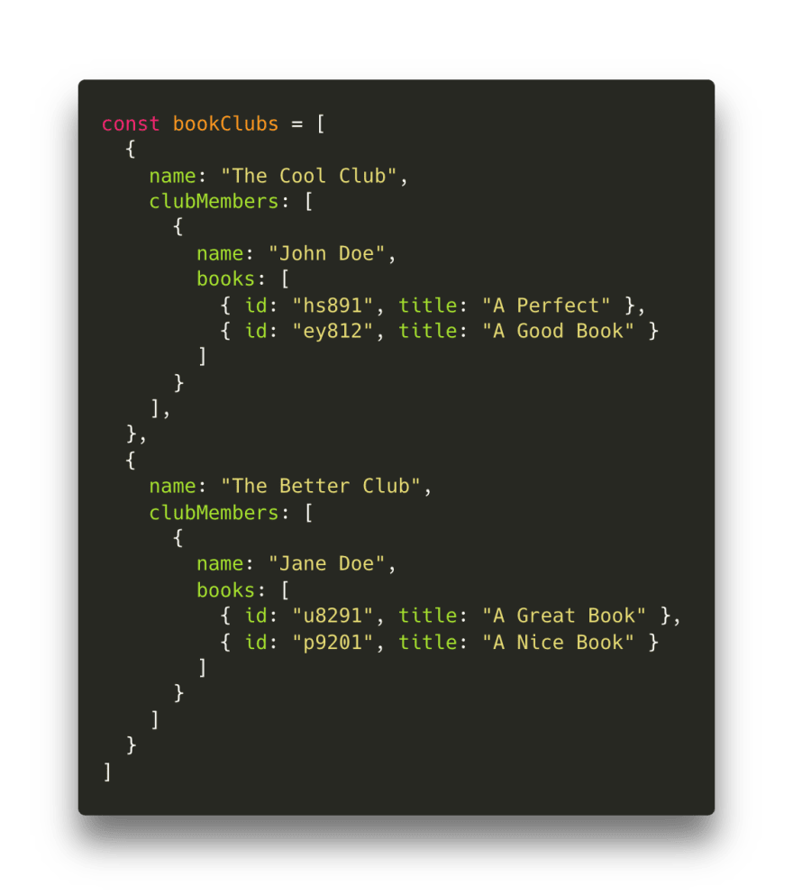

现在我们想要找到 id 为 ey812 的书。为了找到它，我们可以使用嵌套的 for 循环或者 forEach 函数。但是这意味着即使我们找到这个小组成员之后我们仍然需要在数据中寻找下去。

生成器的优点就是除非我们告诉它运行，否则它不会一直运行下去。这意味着我们能够评估每一个返回对象，如果这是我们需要的对象，那么我们就不需要调用 next。让我们看看我们需要怎么实现。

首先，我们创建一个生成器迭代每一个成员的书籍列表。我们会将成员的数据集合传入这个函数，迭代书籍元素，并 yield 每本书。
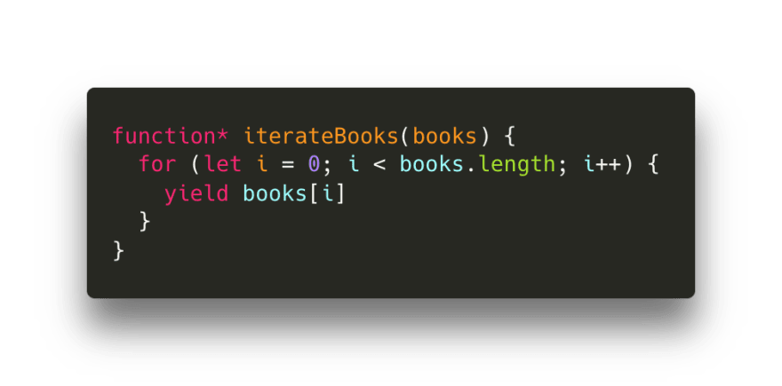

很棒，现在我们创建一个生成器迭代俱乐部成员。我们并不关心成员信息，我们只需要迭代出他们的书籍。在 iterateMembers 生成器中，我们调用 iterateBooks 迭代器以 yield 他们的书籍。
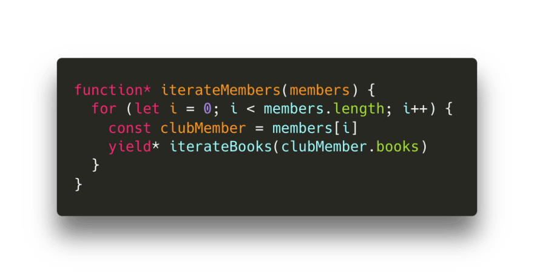

最后一步是迭代整个 bookclubs 。就像之前的例子中，我们并不关心 bookclubs，我们仅关心成员（尤其是他们的书籍）。我们调用 iterateClubMembers 迭代器并将 clubMembers 数组传递进去。
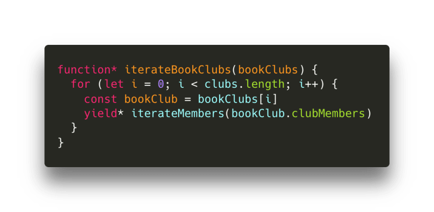

为了迭代整个数据，我们将 bookClub 数组传递进 iterateBookClubs 生成器。
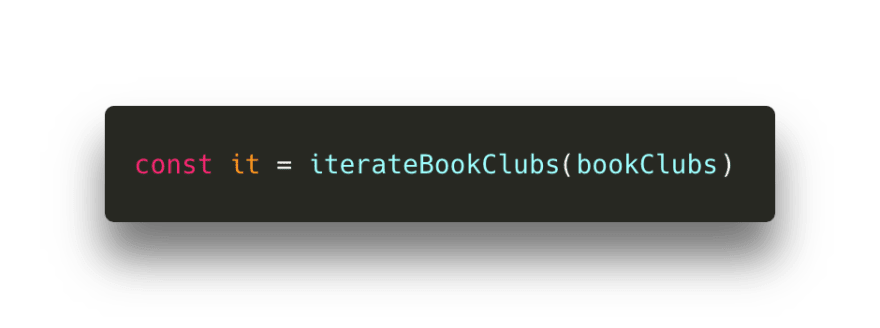

我们调用 next 方法，知道我们获取id=ey812的书籍。
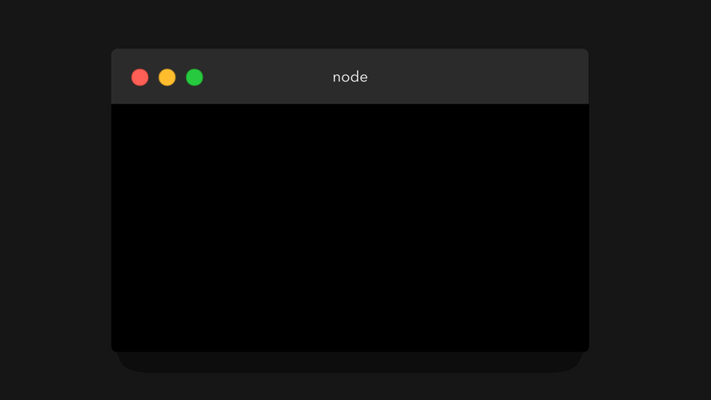

我们并不需要迭代所有数据来获取获取我们需要的书籍。我们仅仅需要找到需要的数据即可。当然，每次手动调用 next 方法并不高效，所以我们可以创建一个函数。

我们向下面这个函数传递一个我们希望寻找的书籍的 id。如果返回数据的 value.id 正是我们所要寻找的，那么就将整个value的值返回。如果不是我们想找的那个 id，就调用 next 方法。
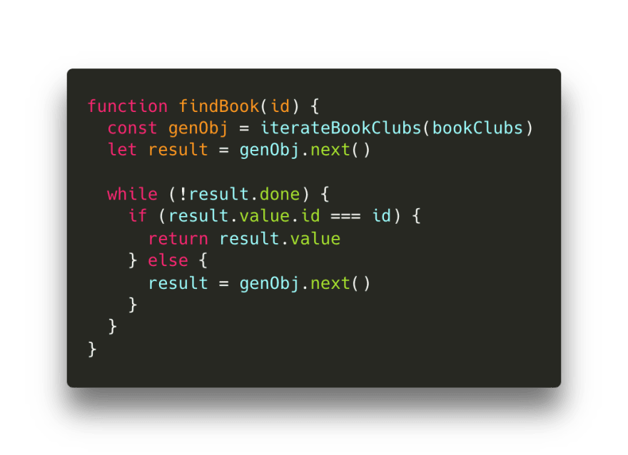

当然这只是个很小的数据集合。但是假设我们有大量数据，又或者是在一个需要解析的数据流中寻找一个数值。正常情况下，我们需要等待整个数据库准备好之后开始解析。使用生成器函数，我们仅需要少量的数据，检查数据，数值仅在我们调用 next 方法时产生。

即使你仍然有"怎么会是这样"的疑问也不要担心。除非你亲自使用它并且有许多使用案例，否则你还会有许多疑惑。我希望你对某些概念会更清晰一些。最后，如果你有任何疑问，请联系本人。

