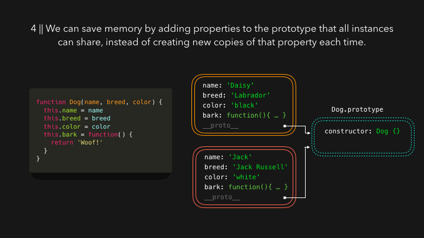

### 可视化之原型继承

转载自[JavaScript Visualized: Prototypal Inheritance  @Lydia Hallie](https://dev.to/lydiahallie/javascript-visualized-prototypal-inheritance-47co)

你是否曾疑惑为何字符串，数字，或者对象能够调用诸如 .length, .split(), .join() 等内建方法呢？我们从来没有明确指定它们，它们从哪里来呢？可不要说：“这是javascript，每人知道为啥，这是魔法”，实际上这是因为原型继承。原型继承非常酷，你使用它比你想的更频繁。

我们经常创建相同类型的对象。例如，我们有一个可供用户浏览狗狗的网站。

对于每个狗狗，我们都有一个对象来表示。我会利用构造函数，通过 new 关键字创建一个 Dog 实例，而不是每次创建一个新对象（我知道你在想啥，后面我会讲到 ES6 的 class。因为这篇文章并不是解释构造函数，所以我不会说太多）。

每个狗狗都有名字，有品种，有颜色，还有一个 bark 的函数。

当我们创建 Dog 构造函数时，还会自动创建其他的对象，被称为原型对象。此对象默认包含一个 constructor 属性，保存着指向原来的构造函数的引用。在本例中，constructor 指向构造函数 Dog 。

构造函数 Dog 中的 prototype 属性是不可枚举的，这意味着当我们遍历对象属性时，这个属性并不会被列出。但是它的确存在。

那么，为什么我们需要这种属性的对象呢？首先，我们创建一些狗狗用来展示。为了简单起见，我称他们 dog1 和 dog2。dog1 叫 Daisy，一只可爱的黑拉布拉多。dog2 叫 Jack，一只无所畏惧的白色杰克罗素。

我们输出 dog1，看看它的属性。

我们看到了我们添加的属性，例如 name, breed, color, 和 bark。但__proto__是什么属性！它是不可枚举的，这意味着在我们试图遍历这个对象属性时，此属性不会被遍历到。我们展开看看这个属性。

这个属性看起来非常像Dog的原型对象。没错，__proto__ 的确是Dog的原型对象的引用。这就是原型继承的内容：每个实例都可以访问构造函数的原型对象。

为什么这很酷呢，因为有时我们需要所有实例都共享的属性。例如此例中的 bark 函数，每个实例都需要相同的方法。我们为何每次实例化对象时都新建一个函数呢，这太浪费内存。我们可以将此方法定义在 Dog 的原型对象上。

不论何时，我们访问实例属性时，JS引擎都会首先在当前对象内部搜索查看此属性是否存在于实例本身。然而，如果它在此对象本身无法搜索到特定属性，JS引擎就会通过__proto__沿着作用域链寻找此属性。

这仅仅只是一步，它还包含好几个步骤。如果你一直跟下来的话，你可能注意到了当我展开 __proto__ 属性时，我并没有包含一个属性。Dog 的原型对象自身就是一个函数，意味着它是 Object 构造函数的实例。这也意味着 Dog 的原型对象也包含这一个 __proto__ 属性，此属性保存着 Object 的对象对象的引用。

最终，我们有了内建方法来自何方的答案：他们来自原型链。

以 toString 为例。它是定义于 dog1 对象自身里的吗？不是。那么它是定义于 Dog 的原型对象中的吗？也不是。那么它是定义于 Dog 原型对象的 __proto__ 所引用的对象中的吗，也就是 Object 的原型对象？是的，没错！

我们刚刚仅使用了构造函数（function Dog() { ... }），它仍然是有效的 JS 代码。然而，ES6 引入了更简单的构造函数语法结合原型一起工作： class！

class 仅仅是构造函数的语法糖。所有的一切还和原来的工作原理一样。

我们使用 class 关键字创建类。一个类具有一个构造函数，此函数基于我们在 ES5 中使用的构造函数语法。我们想要添加到原型中的属性，都被定义在类的内部。

另一个关于类的重要特性是，我们能够更容易地继承其他类。

假如我们想要展示同一种类的多只狗狗，也就是吉娃娃。吉娃娃也是狗。为了保持这个例子足够简单，我现在仅向Dog类传入name属性，而不是name,breed,color属性。但是这些吉娃娃也有些方面比较特别，它们叫声较小。吉娃娃会说 Small woof 而不是 woof。

在一个被继承类中，我们可以使用 super 关键字来进入父类的构造函数。在这个例子中，父类构造函数需要参数，我们也需要向 super 中传入 name。

myPet 可以进入 Chihuahua 和 Dog 的原型中（当然也可以进入 Object 的原型对象中，因为 Dog.prototype 是一个对象）。

因为 Chihuahua 的原型对象具有 smallBark 函数，Dog 的原型对象具有 bark 函数，那么 myPet 可以调用 smallBark 和 bark 函数。

就像你所想象的，原型链并不是无限延续下去。最终有一个原型对象是 null：Object 的原型对象。如果我们试图访问一个当前对象和原型链中都不存在的属性时，会返回 undefined.

尽管我解释了构造函数和类的一切，你仍然可以通过 Object.create 函数为一个对象添加原型。使用这个函数，我们创建一个新对象，而且可以指定此对象的原型对象。

我们将一个对象传入 Object.create 函数中。那么这个对象就是我们新建对象的原型对象。

我们输出下刚刚创建的 me 对象

我们并没有向 me 对象中添加任何属性，它仅仅包含了一个不可枚举的 __proto__ 属性。__proto__ 属性保存着被我们定义为原型的对象的引用：拥有 name 和 age 属性的 person 对象。既然 person 对象是一个对象，那么它的 __proto__ 指向 Object 的原型对象（但是为了阅读的方便，我就不使用 gif 记录展开属性了）。

希望你现在能够明白为什么原型继承在 javascript 世界中是那么重要了。如果你有任何疑问，随时联系本人。

