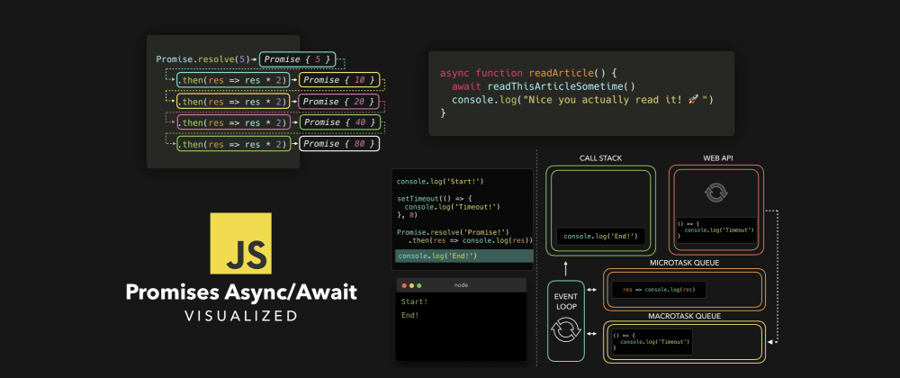
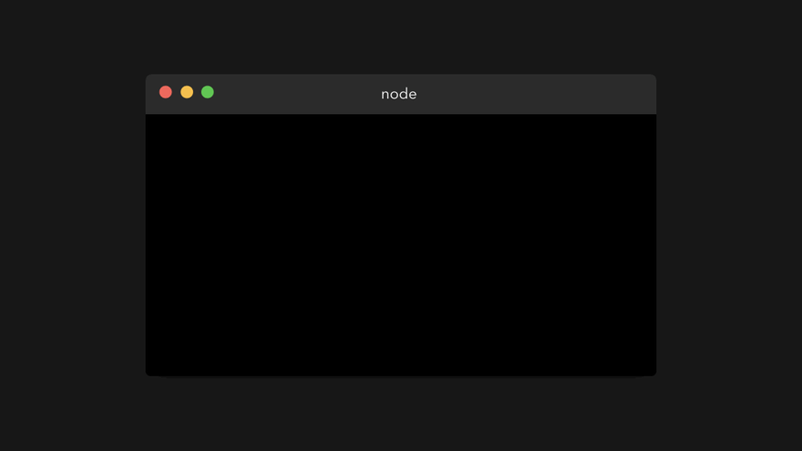
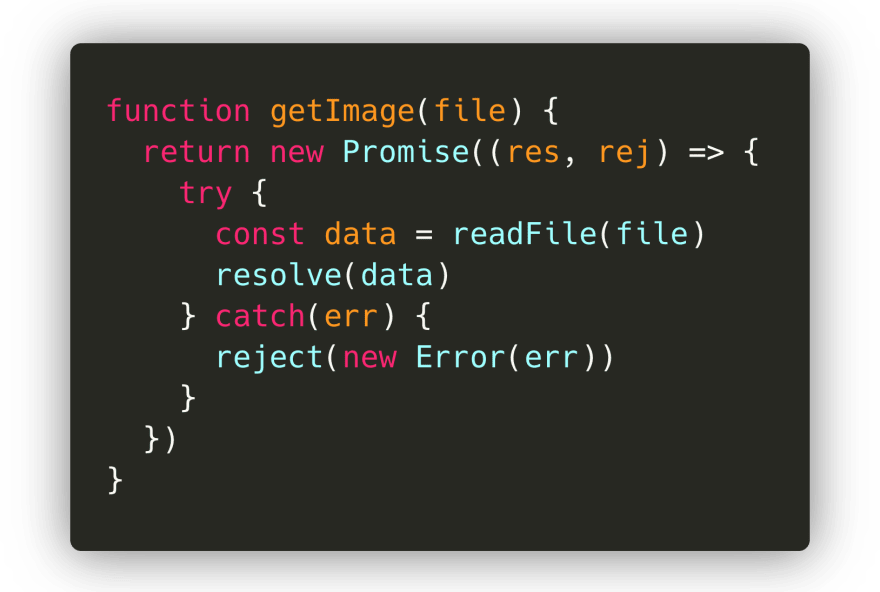
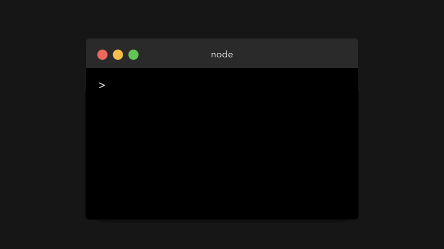
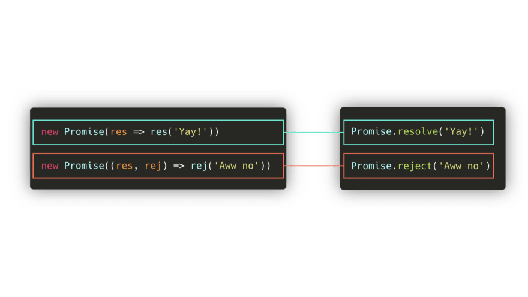
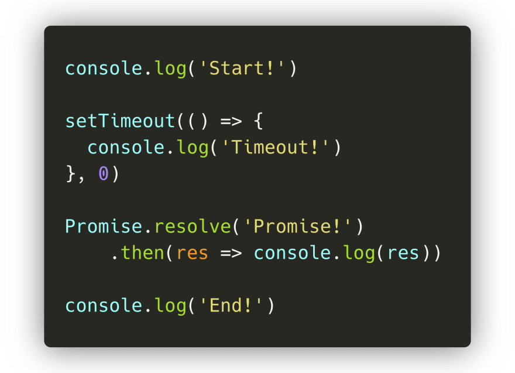
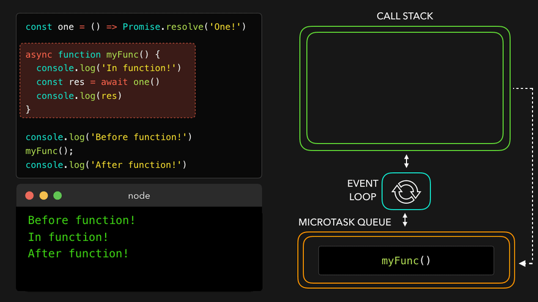

### 可视化之生成器与迭代器

转载自[JavaScript Visualized: Promises & Async/Await @Lydia Hallie](https://dev.to/lydiahallie/javascript-visualized-promises-async-await-5gke)

你是曾经是否处理过那些没有按照你的期望执行的JS代码？看起来就像是函数在不可预见地随机执行，或者延时执行。现在你有机会使用ES6引入的新特性：Promise

多年前的好奇已经得到满足，无眠的夜晚一次次地制作动图。是时候聊聊Promise了：为何要使用它？在JS引擎内部它是如何工作的？还有，我们如何使用它来进行更时髦地编码。

如果你还没有阅读过我写的关于事件循环的文章，那么我建议你先读那篇文章。我将再次提到事件循环，例如调用栈，web API 和任务队列的基本知识，而且这次我还会说到一些更加令人兴奋的新特性。

引言

写JS代码时，我们经常依靠一个任务去处理另一个任务。假设我们需要获取一张图片，压缩它，经过过滤条件，最后下载。

首先需要下载我们想处理的图片。一个 getImage 的函数就可以做到。只要图片下载成功，我们就可以把值传入到 resizeImage 函数。图片尺寸调整成功之后，我们可以将图片传入到 applyFilter 函数进行过滤处理。图片经压缩和经过筛选之后，我们需要告诉用户所有事情都已准备完毕。

最终，我们会得到以下代码：

尽管这代码没问题，但显然不是那么优雅。我们使用了过多的嵌套函数，下一层函数依赖着之前函数的返回值。这被称做回调地狱，因为过多的函数嵌套导致了这些代码非常难以阅读。

幸运地是，我们现在有了 Promise 。现在我们来看看 Promise 是什么，以及如何可以帮助我们解决上面的问题。

Promise

ES6引入了promise，在许多教程中，你会读到下面这些话：

promise 是一个值的占位，这个值可以在未来的某个时刻被 resolve 或者 reject。

这个解释从没有让我更明白这件事。事实上，这只会让我感到Promise是个令人奇怪，模糊，不可捉摸的魔法。既然这样，那么让我们看看 Promise 到底是什么吧。

我们通过向 Promise 构造函数传入一个回调函数来创建一个 promise。就像下面：

等等，返回了什么鬼？

promise 是一个包含了 status（[[PromiseStatus]]）和 value（[[PromiseValue]]）的对象。在上面的例子中，你可以看到 [[PromiseStatus]] 值为 pending ，promise 的值为 undefined。

不要担心，你永远不会和这个对象有交互，甚至你都无法进入到 [[PromiseStatus]] 和 [[PromiseValue]] 属性内部。然而，这些对使用 promise 而言至关重要。

PromiseStatus 的值，也就是 status ，可以是以下三个值之一：

1. ✅fullfilled：promise 已经 resolve。所有事情运行良好，在 promise 内部没有任何错误发生。

2. ❌rejected：promise 被 reject 。也就是 promise 内部发生了某些错误。

3. ⏳pending：promise 既没有 resolve，也没有 reject，处于 pending 状态。

尽管听起来还不错，但是promise的状态什么时候是 pending, fullfiled 或者 rejected 呢？而且，这些状态为啥那么重要呢？

在上面的例子中，我们仅仅向 promise 构造函数中传递了一个简单的函数 ()=>{}。然而，回调函数其实接收两个参数。第一个参数值，常被称为 resolve 或 res，是一个在 promise 应该被 resolve 时调用的函数。第二个参数值，常被称为 reject 或 rej，也是一个函数，在 promise 应该被 reject 或者发生错误是调用。

让我们看看resolve或者reject方法被调用后将会打印什么？在我的例子中，我称 resolve 方法为 res，reject 方法为 rej。

太棒了，我们终于知道如何摆脱 pending 状态和 undefined 值了。如果我们调用 resolve ，promise 的状态为 fullfilled。如果我们调用 reject，promise 的状态为 rejected。

promise 的值，也就是 [[PromiseValue]] 的值，就是我们传入到 reject 或 resolve 方法的参数值。

有意思的是，当前 Chrome 浏览器显示的是 resolved 而不是 fulfilled 状态。

好的，现在我们大概更深入地了解了一些如何控制 promise 对象的方法。那么如何使用它呢？

在引言部分，我们介绍了下载，压缩，筛选，保存图片的例子，尽管这个例子使用了函数嵌套。

幸运地是，promise 可以帮我们修复这些。首先我们重写整个代码块，使得每个函数都返回 promise。

如果当图片下载成功之后，我们使用图片去 resolve 这个 promise。若是下载图片失败，我们使用失败去 reject 这个 promise。

我们来看看在终端运行这段代码会发生什么？
 

很棒，就像我们期待的那样，返回一个 promise 值为我们解析的数据。

但是接下来怎么办呢。我们并不关心整个 promise 对象，我们只关心图片数据的值。还好，有三个内建方法可以得到 promise 的值。我们可以使用三个方法：
.then() 在 promise 被 resovle 之后被调用
.catch() 在 promise 被 reject 之后被调用
.finally() 不论 promise 状态是 resolved 还是 rejected 都会被调用。
 

.then() 方法接收传入到 resolve 方法的值
 

.catch() 方法接收传入到 reject 方法的值

最终我们得到了promise返回的值而不必使用整个promise。我们可以用这些值做任何事情。

当你知道一个值总是 resolved 或者 rejected ，那么你可以使用 Promise.resolve 或者 Promise.reject 去获取一个对应状态的 promise 对象。

你可以在下面的例子中多次看到这个语法。

在 getImage 例子中，我们需要使用多层嵌套函数来运行。但是，现在 .then 就可以帮助我们实现这个功能。

.then 的结果就是一个 promise 值。这意味着我们可以通过链式的方法不断调用 .then ：上一个 .then 的执行结果会作为下一个 .then 回调函数的参数传入。

在上面那个 getImage 的例子，我们可以连续调用 .then 来处理 image 的数据。我们使用 .then 的链式调用取代了多层回调。

很棒，这语法已经看起来比之前的好多了。

宏任务与微任务

上面我们已经更加深入地了解了如何创建一个 promise 和提取 promise 的值了。下面我们运行如下代码：

这个什么鬼？

首先，打印 Start。这没有问题，因为打印 Start 的代码写在第一行。第二个打印了 End，而不是 promise 的 resolve 的值。这个值接着 End 被打印出来。到底发生了什么事情呢?

我们终于见识到了 Promise 的强大。尽管 JS 是单线程运行，但是我们可以使用 Promise 来执行异步操作。

但是，我们是不是见过类似的操作？在之前的 JS 事件循环一文中，我们不就使用了浏览器的内置方法，如 setTimeout 来创建异步代码了吗？

没错。但是在任务队列中，实际上存在两中类型的队列：宏任务队列（也被称为任务队列）和微任务队列。宏任务队列用于宏任务，微任务队列用于微任务。

那么什么是宏任务和微任务呢？最常见的如下表：
（宏）任务：setTimeout | setInterval | setImmediate
微任务：Process.nextTick | Promise callback |queueMicrotask

哈，我们在微任务队列中看到了 Promise。当一个 promise 调用 then, catch, finnaly 方法，此方法的回调函数将会被放入到微任务队列中。这意味着 then, catch, finally 的回调函数并不会立即调用，也就是为我们的 js 代码增加了异步行为。

那么，then, catch, finally 的回调函数什么时候调用呢？事件循环给予了不同任务不同的优先级。

1. 所有在调用栈中的函数都会被调用，函数返回之后就会被弹栈。

2. 当调用栈清空之后，所有的微任务队列都一个接一个的进入调用栈并且被执行（微任务自己也可以返回微任务，甚至可以成为一个无限调用循环）。

3. 如果调用栈和微任务队列都被清空，事件循环就会检查宏任务队列。这些任务会被调入任务队列，执行，然后被弹栈。

我们来看看简单的例子。使用如下：
1. task1 立即被调入执行栈中，例如一个被调用的函数

2. task2, task3, task4, 微任务，例如一个promise的 then 的回调函数，或者一个被加入到 queueMicrotask 的任务。

3. task5, task6 宏任务，例如 setTimeout 和 setImmediate 的回调函数。

首先，task1 入栈执行之后被弹栈。然后JS引擎检查微任务队列。直到微任务队列中的所有任务都进入执行栈执行并弹栈之后，JS引擎开始检查宏任务队列。宏任务入栈执行并弹栈。

下面我们用代码演示：

上面代码有宏任务 setTimeout ，微任务 promise.then 的回调函数。只要JS引擎执行到setTimeout 那行，让我们一步步看看，下面会打印什么。

第一行，JS引擎遇到 console.log 函数。此方法被加入到调用栈中，之后在控制台答应 Start。此方法被弹出，代码继续。

JS 引擎解析到 setTimeout 函数，执行之后被调用栈弹出。setTimeout 函数是浏览器本地方法，它的回调函数（() => console.log('In timeout')）将会被加入到 Web API。尽管我们向定时器中传入的时间是 0，回调函数也会先被加入到 Web API ，时间到了之后回调函数就会被加入到宏任务中：setTimeout 是一个宏任务。

JS引擎遇到 Promise.resolve() 方法。此方法被加入到调用栈中执行，返回一个值为 primise 的 promise 对象。它的 then 方法的回调函数被加入到微任务队列中。

最后，解析到 console.log 函数，在控制台打印 End。

JS引擎看到执行栈空了，所以它会检查微任务队列中是否有任务在排队。的确，then 的回调函数还在等着被调用呢。then 的回调函数被调用，打印 promise。

JS引擎发现调用栈为空，就再次检查微任务队列是否还有待执行任务，发现也为空。

这时就会检查宏任务队列。setTimeout 的回调函数仍在等待。回调函数被调用，打印 Timeout。

最终，完成了。看起来我们之前看到的并不是那么不可预测。

Async / Await

ES7 为JS引入了一个新的异步行为让 promise 的使用更简单。使用 Async/Await 关键字，我们能够创建一个异步函数隐式返回 promise。但是我们怎么才能做到这些呢？

之前，我们能够通过 new Promise(()=>{}) ，Promise.resolve 或者 Promise.reject 的方式直接创建一个 promise 对象。

我们现在可以创建一个异步函数隐式地返回一个对象，而不是直接使用 promise 对象。这意味着我们并不需要自己写 promise 函数。

尽管 Async 函数可以隐式地返回 promise 是非常棒的，但是只有结合 await 关键字才能真正发挥它的长处。使用 await 关键字，我们能够在等待 resolve 数据之时暂停异步函数。如果我们想要像使用then方法一样获取这个 resolved promise 的值，我们需要定义一个变量去保存 await 后面的值。

所以，我们能够暂停一个异步函数。这非常棒，但是，这到底有什么意义呢？

让我们看看运行以下代码会发生什么？

额，发生了什么事？

首先，console.log('Before function!') 执行。打印Before function!

接着，调用 myFunc ，函数体开始执行。输出 In function!。

函数继续执行，在第二行遇到 await 关键字。

首先发生的是await 后面的语句被执行，就是此例中的 one 函数。它被调入调用栈，返回一个 resolved promise。一旦这个 promise 被 resolve，而且返回了数值 one 。JS 引擎就解析到 await 关键字。

当遇到 await 关键字之后，async 函数就会暂停。这个异步函数的执行被暂停，此函数内部的其他部分将会被推入微任务队列，而不是通常的任务队列。

既然 async 函数在执行到 await 关键字之后被暂停了，那么JS引擎就会跳出函数并继续执行。

最终，执行栈为空，JS引擎检查微任务队列中是否有待执行任务。one 函数 resolve 之后，myFunc 函数就会进入到微任务队列的排队状态。myFunc 会被调入执行栈，从上次跳出的地方继续执行。

变量 res 最终获取到了值，也就是 one 返回的值。接着打印字符串 one。

最终，一切执行完毕。你是否感受到了 Async 函数与 then 的不同？await 关键字暂停了 async 函数的执行。然而 promise 并不会继续执行除非我们调用 then 函数。

嗯。的确说了非常多的信息。你并不用担心现在仍然对 promise 感到不解。我个人认为需要不断积累经验并且在面对异步函数时一定要有信心。

希望现在你对于js中令人不解和出乎意料的异步函数能够多了一些了解。还是老样子，如果有任何疑问，请联系本人。

如果你想了解更多 promise 的状态信息，下面这个 github 仓库做了很多很棒的工作去解释它。
[domenic / promises-unwrapping](https://github.com/domenic/promises-unwrapping)

