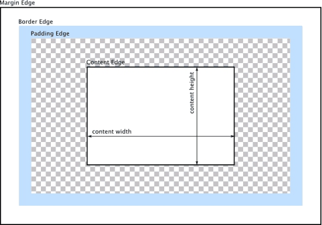

### CSS 小结

- CSS 盒模型

> 标准盒模型；IE盒模型 </br>
> box-sizing: content-box; border-box; padding-box </br>
> 标准盒模型（content-box）：width = content </br>
> 标准盒模型（border-box）：width = content + border + padding </br>


- 画一条0.5px的线 (待深入)
> meta viewport <meta name="viewport" content="initial-scale=1.0, maximum-scale=1.0, user-scalable=no" /> </br>
> border-image </br>
> transform: scale() </br>


- link标签和import标签的区别
> link 由html提供，@import 由css提供 </br>
> link没有兼容性问题，而@import需要IE5以上支持 </br>
> 页面加载时，link标签同步加载；@import 在页面加载完成后加载 </br>
> link权重大于@import </br>

-  transition和animation的区别
> transition 和 animation 大部分的属性是相同的，都是随时间改变属性。但是 transition 是需要触发事件的。而 animation 不需要。transition 是2帧，即 from...to；animation 可以一帧一帧完成 </br>


- flex 布局
> [阮一峰 Flex 布局教程：语法篇](http://www.ruanyifeng.com/blog/2015/07/flex-grammar.html) </br>
> [阮一峰 Flex 布局教程：实例篇](http://www.ruanyifeng.com/blog/2015/07/flex-examples.html) </br>
> flex 布局是 flexible box 的简称，意为弹性布局。是 </br>
> 传统布局方式：display + position + float </br>

- BFC (块级格式化上下文)
> 可用于清除浮动，防止 margin 重叠 </br>
> BFC是页面中一块独立渲染区域，不会影响到外面 </br>
> BFC 不会与 float box 重叠 </br>
> 下面这些元素会生成 BFC: </br>
> 根元素 </br>
> float 不为 none 的元素 </br>
> position : fixed | absolute  </br>
> display: flex | inline-block | table-cell | inline-flex </br>
> overflow 不为 visible </br>

- 水平垂直居中的方法(代码见demo)
> 父子设置相对定位，子设 margin: auto; </br>
> 父子设置相对定位，子利用 transform: translate(-50%,-50%) </br>
> flex 布局 </br>
> 父设 table-cell </br>

- js 动画和 css 动画的差异性
> 渲染进程分为 main thread 和 compositor thread 。如果 css 动画只改变 transform 和 opacity，css 动画会在 compositor thread 运行（而 js 会在 main thread 执行然后发到 compositor thread 进行下一步操作）。如果改变 transform 和 opacity 时是不会重排和重绘的。 </br>
> js 比 css 涵盖的功能更多 </br>
> css3 有兼容性问题 </br>
> css3 动画有事件支持 </br>

- 块级元素和行内元素
> 块级元素：独占一行，并默认在宽度上占满父元素；可以设置 padding, margin, width, height </br>
> 行内元素：不会独占一行，设置 width, height 无效；垂直方向的 padding 和 margin 无效。 </br>
> 行内块元素：通过 display: inline-block 设置。同时不会独占一行，并且可以设置 width, height, margin, padding </br>

- 多行元素的文本省略号
```html
display: -webkit-box
-webkit-box-orient: vertical
-webkit-line-clamp: 3
overflow: hidden
```

- opacity: 0, visibility: hidden, display: none
> opacity: 0 隐藏元素；不影响页面布局；可以响应点击事件 </br>
> visibility: hidden 元素隐藏；不影响页面布局；不能响应点击事件 </br>
> display: none 元素隐藏；影响页面布局；不能响应点击事件；类似删除此元素 </br>
 

- 双边距重叠问题（外边距折叠）
> 相邻元素垂直方向的 margin 会重叠 </br>
> 重叠规则: </br>
> 两个外边距都为正，结果为较大值 </br>
> 两个外边距都为负，结果为绝对值较大值 </br>
> 两个外边距一正一负，结果为二者和 </br>

- position属性 比较
> 1. fixed </br>
> 相对于浏览器窗口固定定位，脱离文档流。即使滚动条滚动也不会改变位置，会和其他元素产生重叠。 </br>
> 2. relative </br>
> 相对于本元素自身位置进行定位。元素仍然占据着原本的位置，当设置定位信息时会覆盖其他元素 </br>
> 3. absolute </br>
> 相对于最近的已定位父元素定位，直到 html 。元素脱离文档流，不在占据文档流中的位置，会覆盖其他元素。 </br>
> 4. sticky </br>
> 元素先按照普通文档流定位，然后相对于该元素在流中的flow root（BFC）和 containing block（最近的块级祖先元素）定位。而后，元素定位表现为在跨越特定阈值前为相对定位，之后为固定定位。 </br>
> 5. static </br>
> 默认值 </br>
> 6. inherit </br>
> 继承父元素 position 属性 </br>

- 浮动清除
```html
1. 为最后一个子元素清楚浮动
.clear
  clear both

2. 父元素加 overflow: auto | hidden


```

- css 优先级
> id选择器 > 类选择器 > 标签选择器 > 伪元素选择器 > 伪类选择器 </br>
> 内联样式 > 内部样式 > 外部引入样式 > 浏览器默认样式 </br>

- z-index 定位方法
> z-index 设置已定位元素的堆叠顺序，数值大者处于更上层，离用户更近。 </br>

- css 的新属性
> 布局方面：flex  </br>
> 动画方面：animation, transform, 2D/3D 变换 </br>
> 选择器：nth-child | first-of-type </br>
> box-sizing </br>
> 媒体查询 </br>

- line-height 和 height 的区别
> line-height 设置字体行高，指的是一行字体的高度。 </br>
> height 设置容器高度 </br>

- 为什么img是inline还可以设置宽高
> 行内元素无法应用 width, height, 垂直方向 padding, margin 无效 </br>
> img 是行内元素也是置换元素。置换元素拥有内置的宽度和高度，也可以设置。其性质与 inline-block 相同 </br>

- 置换元素
> img | input | textarea | select | button | label </br>
> 具备初始的css样式，可以设置高宽。其表现和 inline-block 相同 </br>

- 了解重绘和重排
> DOM 的变化导致页面布局发生变化或者元素高宽发生变化时，浏览器需要重新计算元素几何尺寸，就需要重新构造渲染，这个过程称为重排；浏览器重新绘制受影响的部分称为重绘。 </br>
> 引起重排重绘几点： </br>
> 元素尺寸、位置发生变化 </br>
> 新增、删除、修改可见元素 </br>
> 浏览器窗口大小发生变化 </br>
> 重排一定会有重绘，重绘并不一定会发生重排 </br>
> 元素颜色，透明度等属性发生变化时，会引起重绘 </br>

- 知道怎么去减少重绘和重排吗 
> 使用 className ，csstext 一次性修改元素属性 </br>
> 对于多次重排的元素，如动画，让其脱离文档流，以防止对其他元素的影响。 </br>

- CSS 画正方形，三角形

- overflow 清除浮动的原理
> 当 overflow 的值不为 visible 时，生成块级格式上下文(BFC)。在计算内部高度的时候，也需要把浮动元素的高度计算在内，所以不会发生高度塌陷。 </br>

## TODO
- 复习 CSS 知识点
- em 与 rem 
- 移动端适配方案
- flex 具体详情
- .5px 方案


>  </br>
